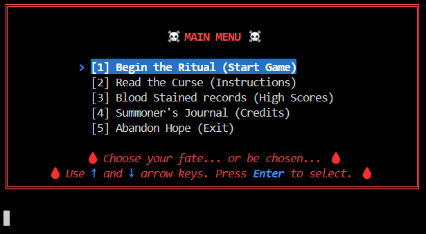
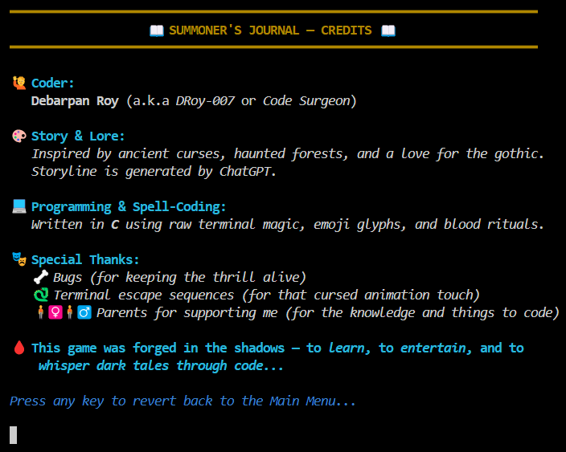
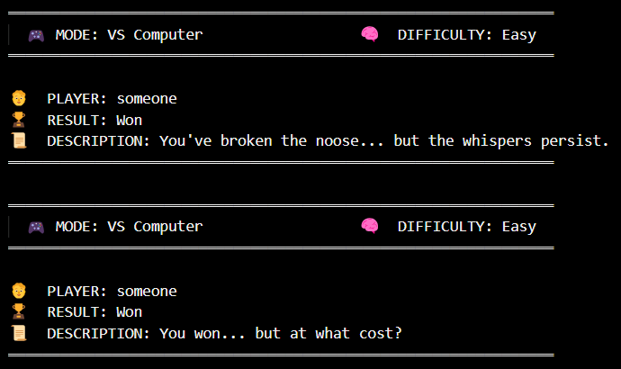

# 🕯️ Dark Ritual Hangman

A cursed reimagining of the classic Hangman game — where each wrong guess pulls you deeper into the abyss, and each correct guess reveals fragments of a **dark fantasy tale**.  
This is not just a game. **It’s a ritual.**

---

## ✨ Features

### 🏮 Cursed Main Menu
- Animated navigation with arrow keys (`↑ ↓ Enter`)  
- Options:  
  - **Begin the Ritual** (start new game)  
  - **Reignite the Curse** (play agian)  
  - **Read the Curse** (instructions)  
  - **Blood Stained records** (high scores)  
  - **Abandon Hope** (quit)  

### 🔮 Difficulty Levels
- **Easy** → Easy words & hints  
- **Medium** → Trickier word bank  
- **Hard** → Words designed to end you  

### ⚔️ Dark Story Integration
- Correct guesses reveal the *lore of a forbidden curse*.  
- Wrong guesses summon the **animated hangman drawing** with ASCII art.  

### 🪦 Animated Effects
- Typewriter effect for suspenseful dialogues.  
- Dark-themed ASCII art for wrong guesses.  
- Banner-like ASCII reveal for achievements or victories.  

### 📜 Extras
- **Credits** section styled as *The Summoner’s Journal*.  
- Score saving in `scoreboard.txt`.  
- Cross-platform terminal handling (Windows/Linux).  

---

## 🖼️ Screenshots (ASCII Preview)

  
  
  
  
  
[🎥 Watch the gameplay](demo-gameplay.mp4)  

---

## 🛠️ Installation & Run

### Clone the repo
```bash
git clone https://github.com/your-username/dark-ritual-hangman.git
cd dark-ritual-hangman
```

### Compile & Run (linux/WSL/MacOs)
```bash
gcc hangman.c -o hangman
./hangman
```

### Compile & Run (Windows MinGW)
```bash
gcc hangman.c -o hangman.exe
hangman.exe
```
---

## 🎮 Controls

- `↑` `↓` → Navigate Menu  
- `Enter` → Select Option  
- `A-Z` or `a-z` → Guess Letters  

---

## ⚡ Project Structure  

Hangman_Game_in_C/  
├── main.c            # Main cursed source code  
├── scoreboard.txt    # Saved scores  
├── assets            # Contains images and demo videos related to the game  
├   ├── welcome-screen.png  
├   ├── main-menu.png  
├   ├── main-menu.png  
├   ├── credits-screen.png  
├   └── scoreboard-file-overview.mp4  
├  
├── .gitignore        # Contains files to be ignored  
└── README.md         # This file  

---

## 📖 Credits  

***🙋 Coder:***
   Debarpan Roy (a.k.a DRoy-007 or Code Surgeon)  

***🎨 Story & Lore:***
   Inspired by ancient curses, haunted forests, and a love for the gothic.  
   Storyline is generated by ChatGPT.  

***💻 Programming & Spell-Coding:***
   Written in C using raw terminal magic, emoji glyphs, and blood rituals.  

***🎭 Special Thanks:***
   🦴 Bugs (for keeping the thrill alive)  
   🐍 Terminal escape sequences (for that cursed animation touch)  
   🧍‍♀️ 🧍‍♂️  Parents for supporting me (for the knowledge and things to code)  

***🩸 This game was forged in the shadows — to learn, to entertain, and to whisper dark tales through code...***

---

## ⚰️ License  

This project is licensed under the MIT License.  
Use it, twist it, summon it in your own way — but beware the curse you awaken.  

---